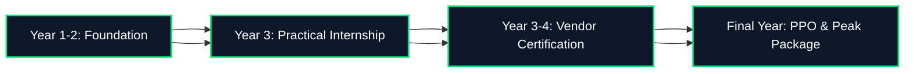

# 🎓 ACC Employability Intelligence & Career Decision Support Platform
### *Problem Statement 5: Data-Driven Evaluation of Practical Internships vs. Industry Certifications*

[](https://streamlit.io/)
[](https://www.python.org/)
[](https://plotly.com/)
[](https://scikit-learn.org/)
[](https://powerbi.microsoft.com/)

---

## 📌 Executive Summary

In today's competitive job market, higher education students face a critical dilemma: **Should they invest time and resources into practical internships, vendor certifications, or both?**

The **ACC Employability Intelligence Platform** provides an empirical, data-backed decision support system based on **2,500+ comprehensive student profiles** across Tier-1, Tier-2, and Tier-3 institutions. Using statistical hypothesis testing, multi-criteria decision analysis (MCDA), and supervised machine learning, the platform quantifies the exact impact of internships and certifications on **placement rates**, **salary packages (LPA)**, **time-to-offer velocity**, and **employer preference**.

---

## 💎 Key Analytical Highlights & Findings

```
┌───────────────────────────────────────────────────────────────────────────────────────┐
│                                 CORE RESEARCH OUTCOMES                                │
├──────────────────────────┬──────────────────────────┬─────────────────────────────────┤
│    PLACEMENT ADVANTAGE   │      SALARY BOOST        │         HYBRID SYNERGY          │
│         +27.8%           │       +₹4.37 LPA         │             98.32%              │
│  Internship vs Cert Only │ (+49.4% Salary Premium)  │   Peak Placement (Hybrid)       │
└──────────────────────────┴──────────────────────────┴─────────────────────────────────┘
```

### 1. Head-to-Head Profile Comparison

| Experience Profile | Student Count | Placement Rate (%) | Avg Placed Salary (LPA) | Employer Preference (1-10) |
| :--- | :---: | :---: | :---: | :---: |
| 🌟 **Both (Hybrid)** | **1,133** | **98.32%** | **₹14.37 LPA** | **8.35 / 10** |
| 💼 **Internship Only** | 711 | 97.75% | ₹13.21 LPA | 7.68 / 10 |
| 📜 **Certification Only** | 436 | 69.96% | ₹8.84 LPA | 4.96 / 10 |
| ❌ **Neither** | 220 | 44.20% | ₹5.45 LPA | 3.42 / 10 |

### 2. Statistical Significance & Validation
* **Welch's Two-Sample t-Test (Salary Premium)**: $t = 20.73, \, p = 8.97 \times 10^{-73}$ ($p < 0.001$), confirming a statistically significant salary advantage for candidates with practical internships over certification-only graduates.
* **Chi-Square Test of Independence (Placement Rate)**: $\chi^2 = 545.53, \, p = 6.46 \times 10^{-118}$ ($p < 0.001$), demonstrating that placement status is strongly dependent on practical industry exposure.

### 3. Internship Duration & Pre-Placement Offers (PPO)
* **6+ Month Internships**: Deliver a **65%+ Direct PPO conversion rate**, drastically reducing time-to-offer post-graduation.
* **Velocity**: Students with practical experience receive job offers **3.2x faster** than certification-only peers.

### 4. Machine Learning Feature Importance (Random Forest Classifier)
1. **Employer Preference Score** (`29.8%`) — Recruiter perception of practical readiness.
2. **Practical Skill Score** (`25.1%`) — Hands-on problem-solving and coding ability.
3. **Theoretical Score** (`22.3%`) — Academic GPA and foundational understanding.
4. **Age / Academic Seniority** (`7.8%`)
5. **Number of Certifications** (`6.2%`)
6. **Number of Internships** (`5.4%`)
7. **Internship Duration** (`3.5%`)

---

## 🚀 Platform Interactive Modules

The web application is built with Streamlit and styled with a custom Glassmorphic Dark UI. It is structured into 6 primary dashboards:

### 1. 📌 Executive Summary
* High-level placement and salary KPIs.
* Distribution box plots across experience profiles.
* Institutional tier breakdown (Tier 1 vs. Tier 2 vs. Tier 3).
* Executive insights callout cards.

### 2. ⚖️ Internship vs Cert Comparison
* Direct head-to-head metric cards.
* 4-Quadrant Practical vs. Theoretical Skill Scatter Matrix with salary sizing.
* Comparative salary package bar charts and statistical test result tables.

### 3. 📊 Placement & Salary Analytics
* Non-linear impact curves for multiple internships vs multiple certifications.
* Internship duration vs. PPO conversion percentage.
* Time-to-Offer distribution histograms.

### 4. 🏢 Employer Preference Engine
* Recruiter rating distributions across technology and business domains.
* Machine learning feature importance breakdown (Random Forest).
* 2D Heatmap: Internship Domain vs. Certification Provider rating matrix.

### 5. 🎯 Skills Demand Engine
* Top 10 high-volume skills among placed candidates.
* Top 10 highest-paying skills (Average LPA).
* Skill Placement Rate vs. Salary Bubble Chart.
* Interactive Skill Deep-Dive Explorer with single-skill selection telemetry.

### 6. 🚀 AI Pathway Advisor & Strategy
* **Interactive Live Career Outcome Predictor**: Real-time simulation of placement probability, expected salary range, PPO likelihood, and recruiter rating based on user degree, branch, college, internships, duration, and certs.
* **Adaptive AI Recommendations**: Dynamic personalized guidance tailored to the student's exact profile.
* **4-Phase Student Career Roadmap**: Strategic blueprint from semester-level internship focus to dual-credential optimization.

---

## 📊 Power BI Dashboard

In addition to the interactive web application, an enterprise-grade **Power BI Dashboard** is included:
* **File Location**: `DASHBOARD/DASHBOARD.pbix`
* **Automated Documentation**: `scripts/create_powerbi_docx.py` creates a formal, formatted Microsoft Word (`.docx`) technical report detailing data models, DAX measures, visual layouts, and color schemas.

---

## 🗂️ Project Structure

```
Problem Statement 5 Website/
├── .streamlit/
│   └── config.toml               # Streamlit theme & server configuration
├── DASHBOARD/
│   └── DASHBOARD.pbix            # Power BI enterprise analytical dashboard
├── dashboards/
│   ├── __init__.py
│   ├── career_outcomes.py        # AI Pathway Advisor & personal outcome simulator
│   ├── employability_impact.py   # Executive summary & tier distributions
│   ├── employer_preference.py    # Recruiter sentiment & ML feature importance
│   ├── internship_vs_cert.py     # Head-to-head comparison & scatter matrices
│   ├── placement_salary.py       # PPO velocity, duration impact & salary distributions
│   └── skills_demand.py          # High-value skill demand & interactive explorer
├── data/
│   ├── employability_dataset.csv # Primary dataset (2,500 student records)
│   ├── employability_dataset.xlsx# Excel format dataset
│   ├── summary_duration_ppo.csv  # Pre-computed duration vs PPO statistics
│   ├── summary_metrics.json      # Pre-computed statistical tests & ML importance
│   ├── summary_multi_certs.csv   # Multi-certification impact summaries
│   ├── summary_multi_internships.csv # Multi-internship impact summaries
│   ├── summary_profile_impact.csv# Experience profile comparison data
│   └── summary_skills_impact.csv # Aggregated skill performance matrix
├── scripts/
│   ├── analyze_data.py           # Data processing, hypothesis tests & ML pipeline
│   ├── create_powerbi_docx.py    # Formatted Word documentation generator
│   └── generate_data.py          # Synthetic dataset generator with correlation logic
├── app.py                        # Streamlit web application entrypoint
├── requirements.txt              # Python package dependencies
├── styles.py                     # Custom CSS glassmorphism theme and components
└── README.md                     # Project documentation & user guide
```

---

## 🛠️ Installation & Setup Guide

### 1. Prerequisites
* **Python 3.9+** (Tested on Python 3.9, 3.10, 3.11, 3.12, 3.13)
* **Git** (optional, for cloning)

### 2. Clone or Navigate to the Workspace
```bash
cd "d:/ACC(Internship)/Problem Statement 5 Website"
```

### 3. Create and Activate a Virtual Environment (Recommended)
```bash
# Windows (PowerShell)
python -m venv venv
.\venv\Scripts\Activate.ps1

# Windows (CMD)
python -m venv venv
.\venv\Scripts\activate.bat

# Linux / macOS
python3 -m venv venv
source venv/bin/activate
```

### 4. Install Dependencies
```bash
pip install -r requirements.txt
```

---

## ⚡ Running the Application

### Launch the Streamlit Web Platform
```bash
streamlit run app.py
```
Once started, the application will automatically open in your default browser at:
```
http://localhost:8501
```

### (Optional) Regenerate Datasets & Run Analysis Pipeline
To regenerate the 2,500 student records and re-run all statistical tests:
```bash
# Generate fresh dataset
python scripts/generate_data.py

# Run statistical testing and ML feature importance pipeline
python scripts/analyze_data.py

# Generate Power BI Word documentation report
python scripts/create_powerbi_docx.py
```

---

## 📈 Dataset Schema & Variables

The primary dataset (`data/employability_dataset.csv`) contains **2,500 student records** across 18 attributes:

| Column Name | Data Type | Description |
| :--- | :--- | :--- |
| `Student_ID` | String | Unique identifier (e.g., `STU10001`) |
| `Age` | Integer | Student age (21 - 25) |
| `Gender` | String | Male, Female, Non-Binary |
| `Education_Level` | String | B.Tech, BCA, B.Sc (CS/IT), M.Tech, MBA |
| `Graduation_Year` | Integer | 2023, 2024, 2025, 2026 |
| `College_Name` | String | Tier 1 (IIT/NIT/BITS), Tier 2, Tier 3 institutions |
| `Course_Branch` | String | CSE, Data Science & AI, IT, ECE, Business Analytics, Cyber Security |
| `Number_of_Certifications`| Integer | Total certifications earned (0 - 5) |
| `Certification_Name` | String | Specific certifications earned (e.g., AWS, Azure, GCP, Meta, IBM) |
| `Certification_Provider` | String | Vendor / provider organization |
| `Number_of_Internships` | Integer | Total internships completed (0 - 4) |
| `Internship_Duration_Months` | Integer | Cumulative internship duration in months (0 - 12) |
| `Internship_Company` | String | Organization (e.g., Microsoft, Google, AWS, Deloitte, Startups) |
| `Internship_Domain` | String | Software Eng, Data Science, Cloud/DevOps, AI/ML, Cyber Security |
| `Experience_Profile` | String | `Internship Only`, `Certification Only`, `Both (Hybrid)`, `Neither` |
| `Primary_Skills` | String | Multi-valued list of technical & soft skills |
| `Practical_Skill_Score` | Integer | Assessed hands-on skill score (1 - 100) |
| `Theoretical_Score` | Integer | Academic and theoretical score (1 - 100) |
| `Employer_Preference_Score`| Float | Recruiter sentiment rating (1.0 - 10.0) |
| `Placement_Status` | String | `Placed` or `Not Placed` |
| `Salary_Package_LPA` | Float | Annual CTC in Lakhs Per Annum (LPA) |
| `PPO_Conversion_Status` | String | `Direct PPO`, `Standard Placement`, `Not Placed` |
| `Time_to_Offer_Days` | Integer | Number of days to secure job offer from graduation |

---

## 🎯 Strategic Action Roadmap for Students



1. **Prioritize Practical Experience First**:
   * Complete at least **1 to 2 internships** lasting **3 to 6 months** before the final year. Internships deliver a **+27.8% higher placement rate** and a **+₹4.37 LPA starting salary boost**.
2. **Target 6+ Month Durations for Direct PPOs**:
   * 6+ month internships convert into **Pre-Placement Offers in >65% of cases**, minimizing time-to-offer and job search friction.
3. **Elevate to Hybrid Status with 1-2 Vendor Certifications**:
   * Pair real-world internship experience with industry certifications (AWS, Azure, Google Cloud, Meta) to reach the **top 5% tier** (98.3% placement, ₹14.37 LPA average package).
4. **Master High-Yield Technical Skills**:
   * Build demonstrable competency in **Python, SQL, Cloud Architecture (AWS), and Machine Learning**.

---

## 💻 Tech Stack

* **Frontend & UI**: [Streamlit](https://streamlit.io/) with custom HTML/CSS glassmorphism dark theme.
* **Data Visualization**: [Plotly Express & Graph Objects](https://plotly.com/python/).
* **Data Manipulation**: [Pandas](https://pandas.pydata.org/), [NumPy](https://numpy.org/).
* **Statistical Computing & ML**: [SciPy](https://scipy.org/) (t-test, chi-square), [Scikit-Learn](https://scikit-learn.org/) (Random Forest Classifier).
* **Enterprise Reporting**: Microsoft Power BI (`.pbix`), [python-docx](https://python-docx.readthedocs.io/).

---

## 👥 Credits & Team

* **Project**: Problem Statement 5 — Employability Intelligence & Career Decision Support Platform
* **Organization**: ACC Internship Program
* **Role**: Data Analyst / Analytics Team

---
*For questions, issues, or contributions, please open an issue or submit a pull request.*
